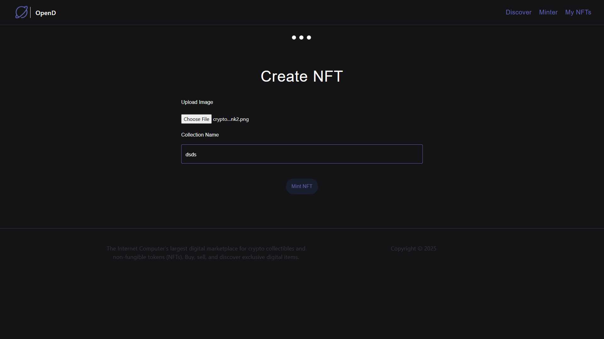
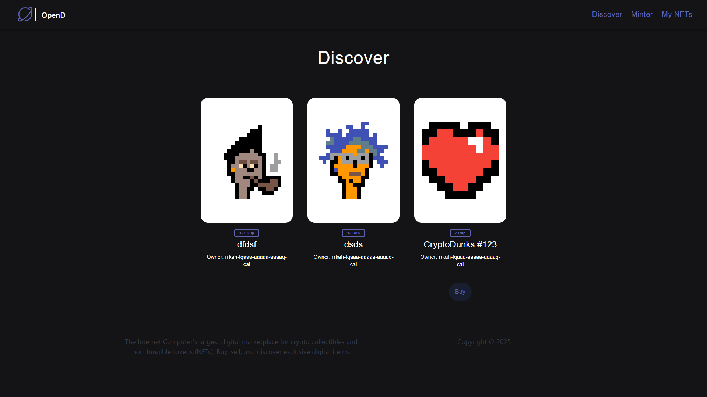

<h1>NFT Marketplace on Internet Computer</h1>
<p>This project is a decentralized NFT marketplace built on the Internet Computer (ICP) using Motoko for the backend and React for the frontend.
It allows users to mint, view, and discover NFTs seamlessly through a blockchain-powered web interface.</p>
<h2>Project Overview</h2>
<p>The NFT Marketplace enables users to create unique digital assets (NFTs), store them securely on the Internet Computer blockchain, and showcase them publicly. Each NFT contains metadata such as name, owner, and image content, ensuring transparency and true digital ownership.

The project demonstrates the integration of frontend (React) and backend (Motoko canisters) using the DFINITY SDK, connecting the decentralized logic with a modern, responsive user interface.</p>

<h2>Key Features</h2>
<p>🔹1. Minting NFTs

  Users can upload images and mint their own NFTs.

  Each NFT is stored as a unique asset on the blockchain.

  Metadata like name and owner principal is saved immutably.

  Powered by a Motoko smart contract that manages NFT logic.

  🔹 2. Viewing Minted NFTs

  After minting, users receive a confirmation page showing their newly created NFT.

  Ownership and asset details are fetched directly from the canister.

  🔹 3. My NFTs Section

  Displays all NFTs owned by the logged-in user.

  Fetches and renders assets stored under the user’s principal ID.

  Clean gallery layout built with React and integrated canister calls.

  🔹 4. Discover Section

  A public gallery showing NFTs minted by all users.

  Helps explore other creators’ NFTs available on the network.

  Encourages engagement and showcases decentralized content.</p>
# To Install and Run the Project
1. start local dfx

```
dfx start --clean
```

2. Run NPM server

```
npm start
```

3. Deploy canisters

```
dfx deploy --argument='("CryptoDunks #123", principal "r4ac2-uva4p-lpemj-xuv2a-t5qlo-mrvlr-tlqpz-rrx4p-kxklc-vlnt5-iae", (vec {137; 80; 78; 71; 13; 10; 26; 10; 0; 0; 0; 13; 73; 72; 68; 82; 0; 0; 0; 10; 0; 0; 0; 10; 8; 6; 0; 0; 0; 141; 50; 207; 189; 0; 0; 0; 1; 115; 82; 71; 66; 0; 174; 206; 28; 233; 0; 0; 0; 68; 101; 88; 73; 102; 77; 77; 0; 42; 0; 0; 0; 8; 0; 1; 135; 105; 0; 4; 0; 0; 0; 1; 0; 0; 0; 26; 0; 0; 0; 0; 0; 3; 160; 1; 0; 3; 0; 0; 0; 1; 0; 1; 0; 0; 160; 2; 0; 4; 0; 0; 0; 1; 0; 0; 0; 10; 160; 3; 0; 4; 0; 0; 0; 1; 0; 0; 0; 10; 0; 0; 0; 0; 59; 120; 184; 245; 0; 0; 0; 113; 73; 68; 65; 84; 24; 25; 133; 143; 203; 13; 128; 48; 12; 67; 147; 94; 97; 30; 24; 0; 198; 134; 1; 96; 30; 56; 151; 56; 212; 85; 68; 17; 88; 106; 243; 241; 235; 39; 42; 183; 114; 137; 12; 106; 73; 236; 105; 98; 227; 152; 6; 193; 42; 114; 40; 214; 126; 50; 52; 8; 74; 183; 108; 158; 159; 243; 40; 253; 186; 75; 122; 131; 64; 0; 160; 192; 168; 109; 241; 47; 244; 154; 152; 112; 237; 159; 252; 105; 64; 95; 48; 61; 12; 3; 61; 167; 244; 38; 33; 43; 148; 96; 3; 71; 8; 102; 4; 43; 140; 164; 168; 250; 23; 219; 242; 38; 84; 91; 18; 112; 63; 0; 0; 0; 0; 73; 69; 78; 68; 174; 66; 96; 130;}))'
```

4. Head to localhost

http://localhost:8080/

# Creating NFT for Testing

1. Mint an NFT on the command line to get NFT into mapOfNFTs:

```
dfx canister call opend mint '(vec {137; 80; 78; 71; 13; 10; 26; 10; 0; 0; 0; 13; 73; 72; 68; 82; 0; 0; 0; 10; 0; 0; 0; 10; 8; 6; 0; 0; 0; 141; 50; 207; 189; 0; 0; 0; 1; 115; 82; 71; 66; 0; 174; 206; 28; 233; 0; 0; 0; 68; 101; 88; 73; 102; 77; 77; 0; 42; 0; 0; 0; 8; 0; 1; 135; 105; 0; 4; 0; 0; 0; 1; 0; 0; 0; 26; 0; 0; 0; 0; 0; 3; 160; 1; 0; 3; 0; 0; 0; 1; 0; 1; 0; 0; 160; 2; 0; 4; 0; 0; 0; 1; 0; 0; 0; 10; 160; 3; 0; 4; 0; 0; 0; 1; 0; 0; 0; 10; 0; 0; 0; 0; 59; 120; 184; 245; 0; 0; 0; 113; 73; 68; 65; 84; 24; 25; 133; 143; 203; 13; 128; 48; 12; 67; 147; 94; 97; 30; 24; 0; 198; 134; 1; 96; 30; 56; 151; 56; 212; 85; 68; 17; 88; 106; 243; 241; 235; 39; 42; 183; 114; 137; 12; 106; 73; 236; 105; 98; 227; 152; 6; 193; 42; 114; 40; 214; 126; 50; 52; 8; 74; 183; 108; 158; 159; 243; 40; 253; 186; 75; 122; 131; 64; 0; 160; 192; 168; 109; 241; 47; 244; 154; 152; 112; 237; 159; 252; 105; 64; 95; 48; 61; 12; 3; 61; 167; 244; 38; 33; 43; 148; 96; 3; 71; 8; 102; 4; 43; 140; 164; 168; 250; 23; 219; 242; 38; 84; 91; 18; 112; 63; 0; 0; 0; 0; 73; 69; 78; 68; 174; 66; 96; 130;}, "CryptoDunks #123")'
```

2. List the item into mapOfListings:

```
dfx canister call opend listItem '(principal "<REPLACE WITH NFT CANISTER ID>", 2)'
```

3. Get OpenD canister ID:

```
dfx canister id opend
```

4. Transfer NFT to OpenD:

```
dfx canister call <REPLACE WITH NFT CANISTER ID> transferOwnership '(principal "<REPLACE WITH OPEND CANISTER ID>", true)'
```

# Conneting to the Token Canister

1. Copy over the token declarations folder

2. Set the token canister id into the <REPLACE WITH TOKEN CANISTER ID>

```
const dangPrincipal = Principal.fromText("<REPLACE WITH TOKEN CANISTER ID>");
```

<div>
  <h1>Minting Page</h1>
    </img>
    <p>The Minting Page allows users to create (mint) their own NFTs by uploading an image, assigning a name, and confirming the minting process. It connects to the backend canister to securely store the NFT data on the blockchain.</p>
</div>

<div>
  <h1>Minted</h1>
    </img>
    <p>Once the minting process is completed, the Minted Page displays a confirmation along with the NFT details — including the name, unique ID, and ownership information — confirming successful NFT creation.</p>
</div>

<div>
  <h1>My NFTs</h1>
    </img>
    <p>The My NFTs Page showcases all NFTs owned by the current user. It fetches NFT data from the blockchain and displays them in a gallery-style layout, allowing the user to view or manage their digital assets.</p>
</div>

<div>
  <h1>Discover</h1>
    </img>
    <p>The Discover Page displays NFTs created by other users on the platform. It helps users explore, view, and potentially interact with NFTs across the entire marketplace.</p>
</div>
